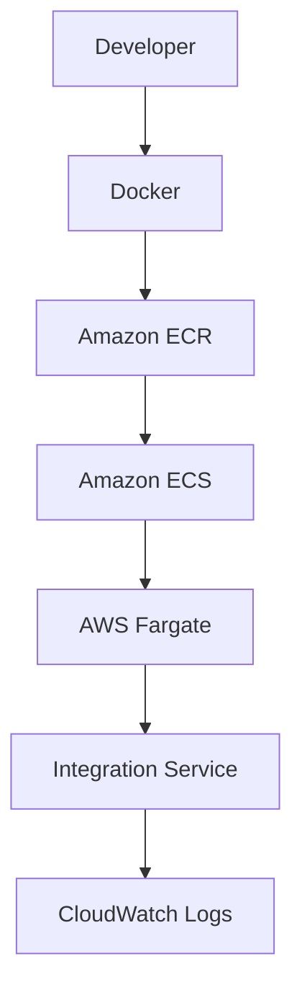

# AWS readiness: ECR y ECS Fargate

Esta guía prepara **solo `integration-service`** para publicar su imagen en Amazon ECR y, cuando sus dependencias estén disponibles, ejecutarla en ECS Fargate. La demo de resiliencia completa (`npm run demo:start` y `npm run demo:retry`) sigue en Docker Compose local. Los comandos que crean o eliminan recursos son **para una fase posterior**: no se han ejecutado ni se han creado recursos AWS durante esta preparación.

## 1. Arquitectura y límite de esta fase



La imagen es la misma implementación NestJS de la demo local. La task propuesta usa Linux/ARM64, `256` unidades de CPU (0,25 vCPU), `1024` MiB de memoria, un contenedor y puerto `3000`. Es una [combinación válida de Fargate](https://docs.aws.amazon.com/AmazonECS/latest/developerguide/fargate-tasks-services.html) y un punto inicial pequeño; habrá que medir memoria y CPU antes de considerarlo un dimensionamiento definitivo. El host de desarrollo y Docker son ARM64, por lo que se construye `linux/arm64` sin emulación. [Fargate soporta ARM64 en Linux con plataforma 1.4.0 o posterior](https://docs.aws.amazon.com/AmazonECS/latest/developerguide/ecs-arm64.html); confirmar la disponibilidad en la región y zona de disponibilidad elegidas.

**Límite de arranque:** `integration-service` exige todas las variables de PostgreSQL y `TypeOrmModule.forRoot()` intenta conectarse antes de que NestJS escuche el puerto. Sin un PostgreSQL **realmente alcanzable desde la task**, el proceso no llega a servir `/health` y Fargate no puede marcarla saludable. `postgres` es un nombre DNS de Docker Compose, no de AWS; `localhost` dentro de Fargate apunta a la propia task. En esta fase no se instala PostgreSQL/RDS ni se agrega un bypass. El constructor de `ExternalApiClient` también exige `EXTERNAL_API_URL` no vacía al arrancar, aunque solo comprueba la conectividad al ejecutar operaciones. `external-api` no se despliega en AWS, así que una task saludable tampoco demostraría integración con ella. **Publicar en ECR sí es independiente; ejecutar una task saludable queda condicionado al acceso aprobado a una base aislada y a configurar una URL externa explícita.** No presentar esa prueba como una demo funcional de resiliencia end-to-end.

## 2. Prerrequisitos y recursos propuestos

Se necesitan Docker, Node.js 22, AWS CLI v2, `jq`, `envsubst`, credenciales AWS con permisos acotados para la fase de creación y una VPC/subnet/security group **existentes**. No se crean VPC, NAT, ALB, RDS, external-api ni otros componentes fuera de alcance. Verificar identidad y región con comandos de solo lectura:

```bash
aws --version
aws sts get-caller-identity
aws configure get region
```

| Recurso futuro | Nombre propuesto | Condición |
| --- | --- | --- |
| Repositorio ECR privado | `aws-community-day-resilient-integration` | Una imagen `v1`; nuevos builds publicados con `v2`, `v3`, etc. |
| CloudWatch Logs log group | `/ecs/aws-community-day-resilient-integration` | Retención propuesta: 7 días. |
| IAM execution role | `resilient-integration-execution-role` | Pull ECR y escritura de logs; lectura del secreto solo si se usa. |
| IAM task role | Ninguno inicialmente | El código no llama directamente a servicios AWS. |
| ECS cluster | `aws-community-day-demo` | Fargate. |
| Task definition family | `resilient-integration-task` | ARM64; una revisión por imagen/configuración. |
| ECS service | `resilient-integration-service` | `desiredCount=1` **solo después** de resolver PostgreSQL. |
| Password de PostgreSQL | Referencia a un secreto existente o futuro | Nunca valor en JSON versionado. |
| Red | VPC, subnet y security group existentes | Sin cambios de red sin aprobación. |

La región propuesta para la siguiente fase es la que confirme `aws configure get region` (en esta preparación figura `us-east-1`); todos los comandos la reciben por variable. Los costos dependerán de esa región y del tiempo de uso: [Fargate factura CPU y memoria por duración](https://aws.amazon.com/fargate/pricing/), [ECR cobra almacenamiento y transferencias aplicables](https://aws.amazon.com/ecr/pricing/), y [CloudWatch Logs cobra ingestión y almacenamiento según uso](https://aws.amazon.com/cloudwatch/pricing/). Si se asigna IPv4 pública, puede haber [cargo por IPv4](https://aws.amazon.com/vpc/pricing/); una NAT Gateway agrega cargo por hora y GB, y **no se propone crearla**. [Secrets Manager cobra por secreto y llamadas](https://aws.amazon.com/secrets-manager/pricing/); [Parameter Store estándar no tiene cargo adicional](https://aws.amazon.com/systems-manager/pricing/). Revisar precios vigentes y estimar con AWS Pricing Calculator antes de aprobar cualquier write.

## 3. Variables para la fase de creación

Ejecutar desde la raíz del repositorio. Los valores entre `<...>` son ejemplos deliberadamente incompletos; sustituirlos solo después de aprobar recursos y región. El account ID se obtiene de STS y no se guarda en Git.

```bash
export AWS_REGION="$(aws configure get region)"
export AWS_ACCOUNT_ID="$(aws sts get-caller-identity --query Account --output text)"
export ECR_REPOSITORY=aws-community-day-resilient-integration
export IMAGE_TAG=v1
export LOG_GROUP=/ecs/aws-community-day-resilient-integration
export ECS_CLUSTER=aws-community-day-demo
export ECS_SERVICE=resilient-integration-service
export TASK_FAMILY=resilient-integration-task
export EXECUTION_ROLE_NAME=resilient-integration-execution-role
export IMAGE_URI="${AWS_ACCOUNT_ID}.dkr.ecr.${AWS_REGION}.amazonaws.com/${ECR_REPOSITORY}:${IMAGE_TAG}"
```

La estrategia de tags es `v1`, `v2`, etc. con repositorio **IMMUTABLE**: cada versión señala una imagen concreta y no se reutiliza `v1` tras publicarla. No se usa `latest` para que la Task Definition conserve una referencia explicable y repetible. El script de build utiliza `v1` por defecto; el de push exige `IMAGE_TAG` explícito.

## 4. Construir y comprobar la imagen local

```bash
bash scripts/aws/build-image.sh
docker image inspect --format '{{.Os}}/{{.Architecture}}' "${ECR_REPOSITORY}:${IMAGE_TAG}"
```

La salida de arquitectura debe ser `linux/arm64`. El script construye desde la raíz con `apps/integration-service/Dockerfile`; no necesita acceso a AWS. Si se elige otra arquitectura en una fase posterior, cambiar **juntos** el build, la validación del script de push y `runtimePlatform` en la plantilla ECS.

## 5. Crear el repositorio ECR privado

**Comando futuro; requiere autorización antes de ejecutarlo:**

```bash
aws ecr create-repository \
  --repository-name "$ECR_REPOSITORY" \
  --image-tag-mutability IMMUTABLE \
  --region "$AWS_REGION"
```

El repositorio debe existir antes de `docker push`. [AWS documenta el flujo crear repositorio → autenticar → etiquetar → publicar](https://docs.aws.amazon.com/AmazonECR/latest/userguide/getting-started-cli.html).

## 6. Autenticarse en ECR

El script de publicación también ejecuta esta autenticación. Para hacerlo manualmente:

```bash
aws ecr get-login-password --region "$AWS_REGION" |
  docker login --username AWS --password-stdin \
    "${AWS_ACCOUNT_ID}.dkr.ecr.${AWS_REGION}.amazonaws.com"
```

La [contraseña de login de ECR](https://docs.aws.amazon.com/cli/latest/reference/ecr/get-login-password.html) se entrega por stdin a Docker; no se imprime ni se versiona.

## 7. Etiquetar y publicar la imagen

**Comando futuro; requiere autorización antes de ejecutarlo:**

```bash
bash scripts/aws/push-image.sh
```

El script comprueba que la imagen local exista y sea ARM64, hace `docker login`, `docker tag` y `docker push` a `IMAGE_URI`. Si el tag `v1` ya existe en ECR inmutable, incrementar `IMAGE_TAG` y reconstruir antes de publicar.

## 8. Crear CloudWatch Logs log group

**Comandos futuros; requieren autorización:**

```bash
aws logs create-log-group --log-group-name "$LOG_GROUP" --region "$AWS_REGION"
aws logs put-retention-policy \
  --log-group-name "$LOG_GROUP" \
  --retention-in-days 7 \
  --region "$AWS_REGION"
```

El grupo se crea explícitamente: la task no necesita `logs:CreateLogGroup`. La configuración `awslogs` en la plantilla envía el `stdout`/`stderr` del contenedor al grupo y usa el prefijo `ecs`; AWS exige [grupo, región y prefijo para Fargate](https://docs.aws.amazon.com/AmazonECS/latest/APIReference/API_LogConfiguration.html). Los logs de NestJS deben aparecer sin archivo local de logs.

## 9. Crear el IAM Task Execution Role

**Comandos futuros; requieren autorización:**

```bash
aws iam create-role \
  --role-name "$EXECUTION_ROLE_NAME" \
  --assume-role-policy-document '{"Version":"2012-10-17","Statement":[{"Effect":"Allow","Principal":{"Service":"ecs-tasks.amazonaws.com"},"Action":"sts:AssumeRole"}]}'
aws iam attach-role-policy \
  --role-name "$EXECUTION_ROLE_NAME" \
  --policy-arn arn:aws:iam::aws:policy/service-role/AmazonECSTaskExecutionRolePolicy
export EXECUTION_ROLE_ARN="$(aws iam get-role --role-name "$EXECUTION_ROLE_NAME" --query Role.Arn --output text)"
```

El **Task Execution Role** da permisos al agente ECS para extraer la imagen ECR y enviar logs. El **Task Role** entrega credenciales al código dentro del contenedor; aquí no se requiere, porque la aplicación no llama a APIs AWS. La [política gestionada de execution role](https://docs.aws.amazon.com/AmazonECS/latest/developerguide/task_execution_IAM_role.html) cubre el caso básico sin permisos administrativos. Si se referencia un secreto, se agrega al execution role permiso de lectura **acotado a su ARN**; no al task role. No conceder `AdministratorAccess`.

## 10. Resolver dependencias y referenciar el password

**Detener aquí la ejecución futura si no hay un PostgreSQL aislado, autorizado y alcanzable desde la subnet de la task.** Configurar `DATABASE_HOST`, `DATABASE_PORT`, `DATABASE_NAME`, `DATABASE_USER` y un ARN real de Secrets Manager para `DATABASE_PASSWORD_SECRET_ARN`. Nunca escribir el password en `environment`, en comandos, en el repositorio ni en la imagen. La plantilla usa [`secrets[].valueFrom`](https://docs.aws.amazon.com/AmazonECS/latest/developerguide/task_definition_parameters.html) para que ECS lo inyecte al arrancar. También se puede usar un ARN de Parameter Store SecureString; en ese caso el execution role necesita `ssm:GetParameters` sobre el parámetro en lugar de `secretsmanager:GetSecretValue`. Si se usa una clave KMS administrada por el cliente, se requiere además `kms:Decrypt` acotado a esa clave.

Ejemplo de política **solo para un secreto de Secrets Manager ya creado**, sin valor del password:

```bash
export DATABASE_PASSWORD_SECRET_ARN='<ARN_DEL_SECRETO>'
aws iam put-role-policy \
  --role-name "$EXECUTION_ROLE_NAME" \
  --policy-name resilient-integration-db-password-read \
  --policy-document "$(jq -n --arg arn "$DATABASE_PASSWORD_SECRET_ARN" '{Version:"2012-10-17",Statement:[{Effect:"Allow",Action:["secretsmanager:GetSecretValue"],Resource:$arn}]}')"
```

**Este comando también es futuro y requiere autorización.** No se crea ningún secreto en esta fase. `EXTERNAL_API_URL` debe ser no vacía para que NestJS arranque, pero al no trasladar `external-api` a AWS, no se deben ejecutar operaciones de negocio en la task. Si se usa una URL de prueba inaccesible, identificarla como tal y no presentar el healthcheck como prueba de conectividad externa. Un `/health` saludable demuestra que el proceso NestJS arrancó con PostgreSQL disponible, no que el escenario completo funcione en AWS.

## 11. Registrar la ECS Task Definition

La plantilla versionada está en [`aws/ecs-task-definition.template.json`](aws/ecs-task-definition.template.json). Contiene placeholders para `IMAGE_URI` (compuesto de account ID y región), `EXECUTION_ROLE_ARN`, `TASK_ROLE_ARN`, `LOG_GROUP`, `AWS_REGION`, configuración de PostgreSQL, `EXTERNAL_API_URL` y ARN del secreto. Su `healthCheck` llama a `127.0.0.1:$PORT/health` con Node 22. ECS [solo observa healthchecks declarados en la Task Definition](https://docs.aws.amazon.com/AmazonECS/latest/developerguide/healthcheck.html), aunque la imagen incluya un `HEALTHCHECK` de Docker. `PORT=3000` debe coincidir con `portMappings.containerPort=3000`; si se modifica el puerto, cambiar ambos.

**Comandos futuros; registrar requiere autorización y un secreto/base disponibles:**

```bash
export DATABASE_HOST='<HOST_POSTGRES_APROBADO>'
export DATABASE_PORT=5432
export DATABASE_NAME='<NOMBRE_BASE_DE_PRUEBA>'
export DATABASE_USER='<USUARIO_DE_PRUEBA>'
export EXTERNAL_API_URL='<URL_API_EXTERNA_SI_EXISTE>'
export TASK_ROLE_ARN="${TASK_ROLE_ARN:-}"
umask 077
TASK_JSON="$(mktemp)"
envsubst '${IMAGE_URI} ${EXECUTION_ROLE_ARN} ${TASK_ROLE_ARN} ${LOG_GROUP} ${AWS_REGION} ${DATABASE_HOST} ${DATABASE_PORT} ${DATABASE_NAME} ${DATABASE_USER} ${EXTERNAL_API_URL} ${DATABASE_PASSWORD_SECRET_ARN}' \
  < aws/ecs-task-definition.template.json |
  jq 'if .taskRoleArn == "" then del(.taskRoleArn) else . end' > "$TASK_JSON"
jq empty "$TASK_JSON"
aws ecs register-task-definition --cli-input-json "file://${TASK_JSON}" --region "$AWS_REGION"
```

`taskRoleArn` aparece como placeholder para uso futuro, pero [AWS indica que es opcional](https://docs.aws.amazon.com/AmazonECS/latest/developerguide/task_definition_parameters.html); el `jq` lo elimina si está vacío. Revisar manualmente el JSON temporal antes de registrar para confirmar que no queden `<...>` ni `${...}`. Borrar ese archivo temporal al terminar. Si se publica una nueva imagen, registrar una nueva revisión con el nuevo tag.

## 12. Crear cluster y ejecutar el servicio Fargate

La task usa `awsvpc`: necesita subnet y security group existentes. Para extraer ECR desde una subnet pública se requiere ruta hacia Internet Gateway y `assignPublicIp=ENABLED`; en subnet privada, salida por NAT o VPC endpoints pertinentes. El security group de la task necesita salida HTTPS hacia ECR, CloudWatch Logs y el servicio de secretos elegido, además de salida al puerto de PostgreSQL; el security group de la base debe permitir la entrada desde el de la task. No se modifica ninguna red en esta fase. El healthcheck ocurre dentro del contenedor, por lo que no hace falta abrir `3000` a Internet; sin ALB no se ofrece un endpoint público de aplicación. [Requisitos de red de Fargate](https://docs.aws.amazon.com/AmazonECS/latest/developerguide/fargate-tasks-services.html).

**Comandos futuros; requieren autorización de recursos, red y acceso PostgreSQL:**

```bash
export SUBNET_ID='<SUBNET_PUBLICA_EXISTENTE>'
export SECURITY_GROUP_ID='<SG_EXISTENTE_SIN_INGRESS_PUBLICO>'
aws ecs create-cluster --cluster-name "$ECS_CLUSTER" --region "$AWS_REGION"
aws ecs create-service \
  --cluster "$ECS_CLUSTER" \
  --service-name "$ECS_SERVICE" \
  --task-definition "$TASK_FAMILY" \
  --desired-count 1 \
  --launch-type FARGATE \
  --platform-version LATEST \
  --network-configuration "awsvpcConfiguration={subnets=[$SUBNET_ID],securityGroups=[$SECURITY_GROUP_ID],assignPublicIp=ENABLED}" \
  --region "$AWS_REGION"
```

Para subnet privada, usar `assignPublicIp=DISABLED` y una ruta de salida ya aprobada; no crear NAT ni endpoints en este alcance. Si PostgreSQL falta, **no crear el servicio**: `desiredCount=1` podría reemplazar repetidamente tasks que no arrancan y generar costos sin cumplir la prueba.

## 13. Revisar estado de la task

```bash
aws ecs describe-services \
  --cluster "$ECS_CLUSTER" --services "$ECS_SERVICE" \
  --query 'services[0].{status:status,running:runningCount,desired:desiredCount,events:events[0:5]}' \
  --region "$AWS_REGION"
aws ecs list-tasks --cluster "$ECS_CLUSTER" --service-name "$ECS_SERVICE" --region "$AWS_REGION"
aws ecs wait services-stable --cluster "$ECS_CLUSTER" --services "$ECS_SERVICE" --region "$AWS_REGION"
```

`RUNNING` indica que el proceso está activo; comprobar también `healthStatus`. Los eventos de ECS y `stoppedReason` permiten distinguir error de imagen/red/IAM de error de aplicación.

## 14. Revisar el healthcheck

```bash
TASK_ARN="$(aws ecs list-tasks --cluster "$ECS_CLUSTER" --service-name "$ECS_SERVICE" --query 'taskArns[0]' --output text --region "$AWS_REGION")"
aws ecs describe-tasks \
  --cluster "$ECS_CLUSTER" --tasks "$TASK_ARN" \
  --query 'tasks[0].{lastStatus:lastStatus,healthStatus:healthStatus,containers:containers[].{name:name,health:healthStatus,exitCode:exitCode,reason:reason}}' \
  --region "$AWS_REGION"
```

Esperar `HEALTHY` en la task y el contenedor. El comando usa el `fetch` incorporado en Node; no depende de `curl` ni `wget` en la imagen final. Si no existe una task activa, consultar también las tasks detenidas y eventos del servicio. Un `/health` HTTP 200 solo es posible después de conectar PostgreSQL durante el arranque.

## 15. Revisar logs y resolver fallos básicos

```bash
aws logs tail "$LOG_GROUP" --since 30m --region "$AWS_REGION"
aws ecs describe-services --cluster "$ECS_CLUSTER" --services "$ECS_SERVICE" \
  --query 'services[0].events[0:10].[createdAt,message]' --region "$AWS_REGION"
```

| Síntoma | Comprobación |
| --- | --- |
| `CannotPullContainerError` | Imagen/tag ARM64 en ECR; execution role; ruta de red a ECR. |
| `ResourceInitializationError` | Acceso al log group o secreto desde execution role; red hacia CloudWatch/Secrets Manager. |
| NestJS no escucha `/health` | Variables `DATABASE_*`, DNS, security group y conectividad a PostgreSQL; mirar logs de TypeORM. |
| `UNHEALTHY` | `PORT`, mapeo `3000`, comando healthcheck, tiempo de arranque y respuesta HTTP. |
| Servicio reemplaza tasks | Revisar eventos y `stoppedReason`; detener/escala a cero si la dependencia no existe. |

ECS envía `SIGTERM` al detener una task y normalmente espera 30 segundos antes de `SIGKILL`; `stopTimeout: 30` lo expresa en la plantilla. El proceso Node debe ser PID 1 para recibir la señal. [Comportamiento oficial de StopTask](https://docs.aws.amazon.com/AmazonECS/latest/APIReference/API_StopTask.html).

## 16. Eliminar los recursos de la prueba

**Comandos destructivos de referencia para la fase posterior, solo tras confirmar el inventario real y su propietario.** Escalar a cero antes de borrar el servicio. Los comandos deben aplicarse únicamente a recursos creados para esta demo; no eliminar secretos o redes preexistentes.

```bash
aws ecs update-service --cluster "$ECS_CLUSTER" --service "$ECS_SERVICE" \
  --desired-count 0 --region "$AWS_REGION"
aws ecs wait services-stable --cluster "$ECS_CLUSTER" --services "$ECS_SERVICE" --region "$AWS_REGION"
aws ecs delete-service --cluster "$ECS_CLUSTER" --service "$ECS_SERVICE" \
  --force --region "$AWS_REGION"
aws ecs wait services-inactive --cluster "$ECS_CLUSTER" --services "$ECS_SERVICE" --region "$AWS_REGION"
aws ecs delete-cluster --cluster "$ECS_CLUSTER" --region "$AWS_REGION"
aws logs delete-log-group --log-group-name "$LOG_GROUP" --region "$AWS_REGION"
aws ecr delete-repository --repository-name "$ECR_REPOSITORY" --force --region "$AWS_REGION"
aws iam delete-role-policy --role-name "$EXECUTION_ROLE_NAME" \
  --policy-name resilient-integration-db-password-read
aws iam detach-role-policy --role-name "$EXECUTION_ROLE_NAME" \
  --policy-arn arn:aws:iam::aws:policy/service-role/AmazonECSTaskExecutionRolePolicy
aws iam delete-role --role-name "$EXECUTION_ROLE_NAME"
```

El `delete-role-policy` aplica solo si se agregó esa política en el paso 10. Registrar las revisiones de Task Definition creadas y ejecutar `aws ecs deregister-task-definition --task-definition '<TASK_DEFINITION_ARN>' --region "$AWS_REGION"` por cada una si se desea retirarlas. Eliminar el archivo JSON temporal con `rm -f "$TASK_JSON"`. No se ejecutó ninguno de estos comandos durante AWS readiness.
