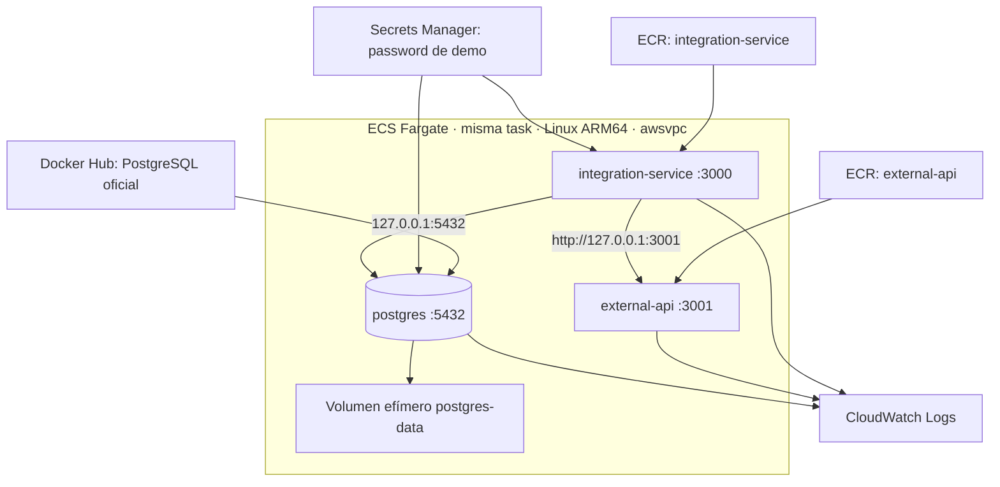

# AWS 2B: propuesta de demo temporal en ECS Fargate

Esta fase prepara una task con **integration-service, external-api y PostgreSQL**. Se validan las imágenes y una configuración equivalente localmente; el discovery AWS es de solo lectura. **Los comandos de creación, publicación y eliminación son futuros y requieren autorización.** No implican que el entorno ya esté desplegado.

La presentación principal sigue usando el MVP local sin cambiar su lógica ni sus comandos:

```bash
npm run demo:start
npm run demo:retry
```

AWS servirá como evidencia de ejecución de los mismos servicios en contenedores administrados. Las operaciones, eventos, estados, idempotencia, clasificación de errores y retry manual permanecen iguales.

## 1. Arquitectura y alcance



Los contenedores de una task `awsvpc` comparten red y [pueden comunicarse mediante localhost](https://docs.aws.amazon.com/AmazonECS/latest/developerguide/fargate-task-networking.html). Se fijan `DATABASE_HOST=127.0.0.1`, `DATABASE_PORT=5432` y `EXTERNAL_API_URL=http://127.0.0.1:3001`. Cada proceso escucha en un puerto distinto.

**PostgreSQL dentro de Fargate es exclusivo de esta demo temporal.** El volumen `postgres-data` se monta en `/var/lib/postgresql/data`, sin `host.sourcePath`, EFS ni almacenamiento externo. Fargate [admite bind mounts efímeros](https://docs.aws.amazon.com/AmazonECS/latest/developerguide/specify-bind-mount-config.html); se conserva el disco por defecto de [20 GiB de la task](https://docs.aws.amazon.com/AmazonECS/latest/developerguide/fargate-task-storage.html), usado también por las imágenes. Al destruir o reemplazar la task se pierden operaciones, eventos y datos PostgreSQL. No hay backups ni snapshots.

Para producción, durabilidad, disponibilidad y recuperación de la base deben evaluarse de forma independiente mediante un servicio apropiado. Esta fase no diseña ni implementa esa arquitectura. La demo temporal no demuestra recuperación después de perder la task.

El alcance continúa sin RDS, ALB, Service Discovery, Route 53, API Gateway, Auto Scaling, NAT Gateway, VPC nueva, SQS, EventBridge, Lambda, Step Functions, Terraform, CloudFormation, CDK ni CI/CD.

## 2. Task y recursos

La definición final propuesta está en [aws/ecs-task-definition.template.json](aws/ecs-task-definition.template.json).

| Propiedad | Propuesta |
| --- | --- |
| Family / launch type | `resilient-integration-task` / `FARGATE` |
| Sistema / arquitectura | Linux / `ARM64` |
| Red | `awsvpc` |
| Task CPU / memoria | `512` unidades, 0,5 vCPU / `2048` MiB, 2 GiB |
| Plataforma Fargate | `1.4.0` |
| Contenedores esenciales | Los tres, con healthcheck explícito |
| Disco | 20 GiB efímeros por defecto; volumen `postgres-data` |
| Task role | Omitido mientras el código no llame a AWS |
| Execution role | `resilient-integration-execution-role` |

| Contenedor | CPU relativa | Memoria reservada | Límite de memoria |
| --- | --- | --- | --- |
| `integration-service` | 256 | 256 MiB | 768 MiB |
| `external-api` | 64 | 128 MiB | 256 MiB |
| `postgres` | 128 | 256 MiB | 768 MiB |
| Suma | 448 | 640 MiB | 1792 MiB |

CPU de contenedor define peso relativo dentro de la task; `memoryReservation` es el umbral flexible y `memory` el límite duro. Las sumas dejan margen dentro de 512/2048. Es un dimensionamiento inicial para el pequeño escenario de demo; medir durante arranque y escenario y comprobar ausencia de OOM antes de fijarlo definitivamente. Una muestra local no representa una prueba de carga.

La validación equivalente local registró aproximadamente 52 / 39,6 / 29,8 MiB en reposo y máximos de cgroup de 78,5 / 57,7 / 82,4 MiB para integración / API externa / PostgreSQL. La suma de máximos individuales es aproximadamente 219 MiB; no es un pico simultáneo medido. Los valores respaldan un tamaño inicial pequeño con margen, sin justificar capacidad productiva.

La combinación [0,5 vCPU / 2 GiB es válida en Fargate](https://docs.aws.amazon.com/AmazonECS/latest/developerguide/task_definition_parameters.html). [ARM64 exige Linux y plataforma 1.4.0 o posterior](https://docs.aws.amazon.com/AmazonECS/latest/developerguide/ecs-arm64.html). En `us-east-1`, excluir la **AZ ID `use1-az3`**; usar IDs de zona, porque sus nombres varían por cuenta. Si una imagen falla por incompatibilidad ARM64, detener la preparación; no cambiar automáticamente a X86_64.

## 3. Imágenes y tags

| Contenedor | Imagen |
| --- | --- |
| integration-service | ECR privado `aws-community-day-resilient-integration:demo-<SHA8>` |
| external-api | ECR privado `aws-community-day-external-api:demo-<SHA8>` |
| postgres | Oficial `postgres:16-alpine`, PostgreSQL 16.15, validada `linux/arm64` |

Los Dockerfiles propios usan Node 22, varias etapas, dependencias de producción, usuario `node`, healthcheck y stdout/stderr. PostgreSQL conserva el entrypoint oficial y su manejo de permisos. El digest público validado es `sha256:721873c34ceb9f8d8fc265984940dc982404c105f19ad51be9fdc5970a6080ea`; se fija en `POSTGRES_IMAGE` para repetir esa imagen.

Ambos repositorios ECR serán **IMMUTABLE**, con `scanOnPush=true` y cifrado `AES256`. Las imágenes propias usarán `demo-<SHORT_GIT_SHA>`, con los ocho primeros caracteres del commit, sin depender de `latest`. Reconstruir después de confirmar cambios. El script de push exige checkout limpio, tag exacto y etiquetas `org.opencontainers.image.revision=<SHA completo>` y `demo.source-clean=true`.

El pull público de PostgreSQL depende de Docker Hub y sus [límites de uso](https://docs.docker.com/docker-hub/usage/). Un rate limit puede impedir el arranque. No se agrega un repositorio PostgreSQL ni credenciales de registro en esta propuesta; reevaluar si ocurre ese límite.

## 4. Healthchecks y dependencias

```text
postgres HEALTHY
    ↓
external-api START → HEALTHY
    ↓
integration-service START → HEALTHY
```

`external-api` depende de `postgres:HEALTHY`; `integration-service` depende de **ambos** con condición `HEALTHY`. ECS [comprueba estas dependencias durante el arranque y revierte el orden al detener](https://docs.aws.amazon.com/AmazonECS/latest/APIReference/API_ContainerDependency.html). No se usan sleeps arbitrarios. La dependencia no supervisa por sí sola fallos posteriores; los healthchecks siguen haciéndolo.

Los tres contenedores declaran `startTimeout=120` y `stopTimeout=30`. El plazo de arranque se configura también en PostgreSQL, la dependencia que debe alcanzar `HEALTHY`; `startPeriod` del healthcheck no sustituye ese plazo. [Definición de startTimeout](https://docs.aws.amazon.com/AmazonECS/latest/APIReference/API_ContainerDefinition.html#ECS-Type-ContainerDefinition-startTimeout).

| Contenedor | Healthcheck |
| --- | --- |
| postgres | `pg_isready -h 127.0.0.1 -p 5432`, con usuario/base configurados. TCP evita dar por saludable el servidor temporal de inicialización que solo escucha por socket Unix. |
| external-api | Node consulta `http://127.0.0.1:3001/health`, exige HTTP exitoso y limita el tiempo de espera. |
| integration-service | `node /app/healthcheck.cjs`: exige HTTP exitoso de `/health` y conexión autenticada a PostgreSQL que ejecute `SELECT 1` con las mismas variables `DATABASE_*`. |

No se altera `/health` ni se omite TypeORM. El chequeo de imagen confirma acceso actual a la base aunque el HTTP siga abierto después de una caída. Los comandos y tiempos están en la Task Definition. [ECS determina la salud mediante contenedores esenciales con healthcheck declarado](https://docs.aws.amazon.com/AmazonECS/latest/developerguide/healthcheck.html); la task solo estará `HEALTHY` cuando los tres lo estén. Ningún healthcheck ejecuta retries de negocio.

PostgreSQL recibe `POSTGRES_INITDB_ARGS=--auth-host=scram-sha-256` para exigir password en conexiones TCP a loopback. Esto se aplica al inicializar una base vacía; reutilizar un volumen ya inicializado no cambia su `pg_hba.conf`. La prueba local confirmó `SELECT 1` exitoso con el password correcto y healthcheck fallido con uno incorrecto. La autenticación local por socket del entrypoint oficial no se comparte con los servicios de la task.

## 5. Validación local equivalente

Requisitos: Docker con Compose, Node 22, npm y `openssl`. Ejecutar desde la raíz en Bash; si hace falta, cargar nvm y ejecutar `nvm use 22`. El `docker-compose.yml` original conserva la demo principal.

Construir las dos imágenes, sin AWS:

```bash
IMAGE_TAG=local-2b bash scripts/aws/build-image.sh all
export POSTGRES_IMAGE=postgres:16-alpine@sha256:721873c34ceb9f8d8fc265984940dc982404c105f19ad51be9fdc5970a6080ea
docker pull --platform linux/arm64 "$POSTGRES_IMAGE"
docker image inspect --format '{{.Os}}/{{.Architecture}}' \
  aws-community-day-resilient-integration:local-2b \
  aws-community-day-external-api:local-2b "$POSTGRES_IMAGE"
```

`local-2b` permite probar cambios antes del commit; no es publicable. [aws/docker-compose.task-demo.yml](aws/docker-compose.task-demo.yml) comparte el namespace de PostgreSQL mediante `network_mode: service:postgres`. Los servicios usan loopback, variables y healthchecks equivalentes. Solo publica al host local `127.0.0.1:13000` y `127.0.0.1:13001`; no publica PostgreSQL. Se exige password por environment:

```bash
export IMAGE_TAG=local-2b
export POSTGRES_PASSWORD="$(openssl rand -hex 32)"
docker compose -p resilient-task-demo -f aws/docker-compose.task-demo.yml \
  up -d --no-build --wait --wait-timeout 180
docker compose -p resilient-task-demo -f aws/docker-compose.task-demo.yml ps
INTEGRATION_URL=http://127.0.0.1:13000 EXTERNAL_API_URL=http://127.0.0.1:13001 npm run demo:start
INTEGRATION_URL=http://127.0.0.1:13000 EXTERNAL_API_URL=http://127.0.0.1:13001 npm run demo:retry
curl --fail http://127.0.0.1:13001/admin/stats
npm test
docker stats --no-stream
```

Esperar `FAILED_RETRYABLE` en intento 1, luego `FINISHED` en intento 2, misma `EXT-78432`, `createCalls=1`, `confirmCalls=2` y `transactionsCreated=1`. Los scripts reciben las URLs mediante variables ya existentes. Repetir `demo:start` debe reconstruir el estado determinista. Comprobar también `BUSINESS_ERROR` → `FAILED_BUSINESS` y retry HTTP 409.

Comprobar la dependencia real deteniendo PostgreSQL: el healthcheck de integración debe terminar con código distinto de cero, incluso si el proceso HTTP sigue vivo:

```bash
docker compose -p resilient-task-demo -f aws/docker-compose.task-demo.yml stop postgres
docker compose -p resilient-task-demo -f aws/docker-compose.task-demo.yml \
  exec -T integration-service node /app/healthcheck.cjs
```

Cerrar y eliminar el volumen anónimo local, que `down` por sí solo conserva:

```bash
docker compose -p resilient-task-demo -f aws/docker-compose.task-demo.yml down -v
unset POSTGRES_PASSWORD IMAGE_TAG POSTGRES_IMAGE
```

La prueba local comprueba imágenes, loopback, orden y escenario. IAM, pull desde AWS y la salud real de Fargate quedan para la fase autorizada.

Validación realizada el 29 de septiembre de 2026: las tres imágenes funcionaron en ARM64 y los tres contenedores quedaron saludables usando la misma red. `demo:start` y `demo:retry` conservaron la salida del baseline local; el escenario terminó `FINISHED`, intento 2, misma `EXT-78432` y una sola creación externa. La conexión SCRAM aceptó el password correcto y rechazó el incorrecto. Los 7 tests pasaron y el Compose original también quedó saludable con los Dockerfiles finales. Las muestras de memoria se registran en la sección 2; no hubo una prueba de carga.

## 6. Inventario exacto propuesto

| Recurso | Nombre / configuración |
| --- | --- |
| Región | `us-east-1`, confirmar en discovery |
| ECR integration | `aws-community-day-resilient-integration`; privado, IMMUTABLE, scanOnPush, AES256 |
| ECR external | `aws-community-day-external-api`; mismas opciones |
| Logs | `/ecs/aws-community-day-resilient-integration`; retención 7 días; prefijos `integration`, `external`, `postgres` |
| Execution role | `resilient-integration-execution-role`; política inline `resilient-integration-task-execution` |
| Secreto | `aws-community-day/demo/postgres-password`; un password aleatorio de demo |
| Security group nuevo | `resilient-integration-demo-sg`; sin ingress, solo egress TCP 443 IPv4 |
| Cluster | `aws-community-day-demo` |
| Task family | `resilient-integration-task`; revisión con tres contenedores |
| Servicio | `resilient-integration-service`; una task, plataforma 1.4.0 |
| Red reutilizada | Default VPC y subnet pública existente apta para ARM64; Internet Gateway existente |
| Recursos administrados | ENI e IPv4 por task; `AWSServiceRoleForECS` solo si falta |

No crear Default VPC si falta ni modificar rutas existentes sin nueva autorización. Account ID, VPC, subnet y ARN reales se obtienen por discovery y se mantienen fuera de Git.

## 7. Discovery de solo lectura

Después de completar las pruebas locales, comprobar identidad, región, Default VPC, DNS, subnet, rutas e Internet Gateway. No mostrar claves, tokens ni valores de secretos.

```bash
aws --version
aws sts get-caller-identity --query '{Account:Account,Arn:Arn}' --output json
aws configure get region
export AWS_REGION=us-east-1
export VPC_ID="$(aws ec2 describe-vpcs --region "$AWS_REGION" \
  --filters Name=is-default,Values=true --query 'Vpcs[0].VpcId' --output text)"
aws ec2 describe-vpc-attribute --vpc-id "$VPC_ID" --attribute enableDnsSupport --region "$AWS_REGION"
aws ec2 describe-vpc-attribute --vpc-id "$VPC_ID" --attribute enableDnsHostnames --region "$AWS_REGION"
aws ec2 describe-subnets --region "$AWS_REGION" --filters "Name=vpc-id,Values=$VPC_ID" \
  --query 'Subnets[].{SubnetId:SubnetId,AZ:AvailabilityZone,AZId:AvailabilityZoneId,PublicIP:MapPublicIpOnLaunch,State:State}'
aws ec2 describe-route-tables --region "$AWS_REGION" --filters "Name=vpc-id,Values=$VPC_ID" \
  --query 'RouteTables[].{Id:RouteTableId,Associations:Associations,Routes:Routes}'
aws ec2 describe-internet-gateways --region "$AWS_REGION" --filters "Name=attachment.vpc-id,Values=$VPC_ID"
aws ecr get-registry-scanning-configuration --region "$AWS_REGION"
aws iam get-role --role-name AWSServiceRoleForECS --query 'Role.Arn'
aws iam get-role --role-name resilient-integration-execution-role --query 'Role.Arn'
aws ecr describe-repositories --region "$AWS_REGION" \
  --repository-names aws-community-day-resilient-integration aws-community-day-external-api
aws logs describe-log-groups --region "$AWS_REGION" \
  --log-group-name-prefix /ecs/aws-community-day-resilient-integration
aws secretsmanager describe-secret --region "$AWS_REGION" \
  --secret-id aws-community-day/demo/postgres-password
aws ec2 describe-security-groups --region "$AWS_REGION" \
  --filters "Name=vpc-id,Values=$VPC_ID" Name=group-name,Values=resilient-integration-demo-sg
aws ecs describe-clusters --clusters aws-community-day-demo --region "$AWS_REGION"
```

`NoSuchEntity` o `ResourceNotFoundException` puede confirmar ausencia. `AccessDenied` significa no comprobado. No sobrescribir recursos con el mismo nombre pertenecientes a otro proyecto.

**Resultado de discovery: WARNING.** El intento de solo lectura, posterior a las pruebas locales, encontró AWS CLI 2.36.19 y región configurada `us-east-1`, pero STS respondió `InvalidClientTokenId`, VPC `AuthFailure` y ECR/ECS/Logs `UnrecognizedClientException`. El perfil SSO alternativo también tenía el token vencido y falló su refresh. Las credenciales deben renovarse antes de confirmar identidad, Default VPC, subnet, security groups, configuración de escaneo y recursos existentes. No se deduce su ausencia ni se guardan IDs reales. No se realizaron writes AWS.

El escaneo ECR depende de la configuración efectiva del registro. [AWS recomienda configuración de escaneo a nivel de registro](https://docs.aws.amazon.com/AmazonECR/latest/userguide/image-scanning-basic.html). Además de enviar `scanOnPush=true` al crear repositorios, comprobar que reglas BASIC/ENHANCED cubran ambos. Si no los cubren, documentar el cambio y obtener autorización antes de modificar una política que afecte otros repositorios.

## 8. Variables de la fase futura

Los siguientes bloques son referencia para **después de aprobar inventario y costos**. Requieren AWS CLI v2, `jq`, `envsubst`, `openssl` y `rg`. Ejecutar en Bash desde el commit limpio que se desplegará. Usar archivos temporales fuera de Git y no activar `set -x`.

```bash
set -euo pipefail
export AWS_REGION=us-east-1
AWS_ACCOUNT_ID="$(aws sts get-caller-identity --query Account --output text)"
export AWS_ACCOUNT_ID
export INTEGRATION_ECR_REPOSITORY=aws-community-day-resilient-integration
export EXTERNAL_ECR_REPOSITORY=aws-community-day-external-api
export IMAGE_TAG="demo-$(git rev-parse --short=8 HEAD)"
export REGISTRY="${AWS_ACCOUNT_ID}.dkr.ecr.${AWS_REGION}.amazonaws.com"
export INTEGRATION_IMAGE_URI="${REGISTRY}/${INTEGRATION_ECR_REPOSITORY}:${IMAGE_TAG}"
export EXTERNAL_IMAGE_URI="${REGISTRY}/${EXTERNAL_ECR_REPOSITORY}:${IMAGE_TAG}"
export POSTGRES_IMAGE=postgres:16-alpine@sha256:721873c34ceb9f8d8fc265984940dc982404c105f19ad51be9fdc5970a6080ea
export POSTGRES_USER=demo
export POSTGRES_DB=integration_demo
export LOG_GROUP=/ecs/aws-community-day-resilient-integration
export SECRET_NAME=aws-community-day/demo/postgres-password
export EXECUTION_ROLE_NAME=resilient-integration-execution-role
export EXECUTION_POLICY_NAME=resilient-integration-task-execution
export ECS_CLUSTER=aws-community-day-demo
export ECS_SERVICE=resilient-integration-service
export TASK_FAMILY=resilient-integration-task
export VPC_ID='<DEFAULT_VPC_EXISTENTE>'
export SUBNET_ID='<SUBNET_PUBLICA_EXISTENTE_NO_USE1_AZ3>'
export TASK_ROLE_ARN=''
umask 077
```

Sustituir todos los `<...>` antes de ejecutar. El password no se exporta para AWS: ECS lo inyecta mediante el ARN del secreto. Para validar otra revisión PostgreSQL, actualizar el digest explícitamente y repetir las pruebas ARM64 y escenario.

## 9. Comandos futuros: ECR y publicación

```bash
aws ecr create-repository --repository-name "$INTEGRATION_ECR_REPOSITORY" \
  --image-tag-mutability IMMUTABLE --image-scanning-configuration scanOnPush=true \
  --encryption-configuration encryptionType=AES256 --region "$AWS_REGION"
aws ecr create-repository --repository-name "$EXTERNAL_ECR_REPOSITORY" \
  --image-tag-mutability IMMUTABLE --image-scanning-configuration scanOnPush=true \
  --encryption-configuration encryptionType=AES256 --region "$AWS_REGION"
bash scripts/aws/build-image.sh all
bash scripts/aws/push-image.sh all
aws ecr describe-images --repository-name "$INTEGRATION_ECR_REPOSITORY" \
  --image-ids "imageTag=$IMAGE_TAG" --region "$AWS_REGION"
aws ecr describe-images --repository-name "$EXTERNAL_ECR_REPOSITORY" \
  --image-ids "imageTag=$IMAGE_TAG" --region "$AWS_REGION"
```

Se puede pasar `integration-service` o `external-api` en lugar de `all`. El push valida ambas imágenes antes de autenticar/publicar. La autenticación entrega [`aws ecr get-login-password`](https://docs.aws.amazon.com/cli/latest/reference/ecr/get-login-password.html) por stdin a Docker. Login manual equivalente:

```bash
aws ecr get-login-password --region "$AWS_REGION" | \
  docker login --username AWS --password-stdin "$REGISTRY"
```

Si un tag ya existe, comprobar el digest; no sobrescribir ni desactivar inmutabilidad. Un cambio de código requiere commit y tag nuevos.

## 10. Comandos futuros: logs, secreto e IAM

```bash
aws logs create-log-group --log-group-name "$LOG_GROUP" --region "$AWS_REGION"
aws logs put-retention-policy --log-group-name "$LOG_GROUP" \
  --retention-in-days 7 --region "$AWS_REGION"
```

Los tres contenedores usan `awslogs`, prefijos diferenciados y `mode=non-blocking`, `max-buffer-size=1m` explícitos. Si se llena el buffer pueden perderse logs; no se bloquea la aplicación por enviarlos. El grupo se crea antes: no se concede `logs:CreateLogGroup` a la task. [Opciones oficiales de awslogs](https://docs.aws.amazon.com/AmazonECS/latest/APIReference/API_LogConfiguration.html).

Crear **un solo secreto** cuyo valor sea un password aleatorio en texto plano de Secrets Manager, no un objeto JSON. Generarlo en archivo restringido, pasarlo al CLI y eliminarlo sin imprimirlo ni versionarlo:

```bash
create_demo_secret() (
  set -euo pipefail
  umask 077
  secret_file="$(mktemp)"
  trap 'rm -f "$secret_file"' EXIT
  openssl rand -hex 32 | tr -d '\n' > "$secret_file"
  aws secretsmanager create-secret \
    --name "$SECRET_NAME" --secret-string "file://${secret_file}" \
    --description 'Password aleatorio de PostgreSQL para demo temporal ECS' \
    --query ARN --output text --region "$AWS_REGION"
)
POSTGRES_PASSWORD_SECRET_ARN="$(create_demo_secret)"
export POSTGRES_PASSWORD_SECRET_ARN
unset -f create_demo_secret
```

Se usa la clave administrada por AWS para Secrets Manager; no se crea una clave KMS. El mismo ARN se inyecta en `POSTGRES_PASSWORD` de PostgreSQL y `DATABASE_PASSWORD` de integración con `secrets[].valueFrom`. El valor no aparece en `environment`. Un cambio del secreto requiere nueva task para inyectarse.

El execution role permite al agente ECS extraer las dos imágenes, escribir en este log group y leer este secreto. [AWS distingue estos permisos de los del código de aplicación](https://docs.aws.amazon.com/AmazonECS/latest/developerguide/task_execution_IAM_role.html). No se agrega task role ni permisos administrativos. La política acota repositorios y secreto a sus ARN; `ecr:GetAuthorizationToken` requiere `Resource="*"`. No se agrega `kms:Decrypt` al usar la clave predeterminada.

```bash
aws iam create-role --role-name "$EXECUTION_ROLE_NAME" \
  --assume-role-policy-document file://aws/execution-role-trust.json
EXECUTION_ROLE_ARN="$(aws iam get-role --role-name "$EXECUTION_ROLE_NAME" \
  --query Role.Arn --output text)"
export EXECUTION_ROLE_ARN
policy_file="$(mktemp)"
envsubst '${AWS_REGION} ${AWS_ACCOUNT_ID} ${INTEGRATION_ECR_REPOSITORY} ${EXTERNAL_ECR_REPOSITORY} ${LOG_GROUP} ${POSTGRES_PASSWORD_SECRET_ARN}' \
  < aws/execution-role-policy.template.json > "$policy_file"
jq empty "$policy_file"
aws iam put-role-policy --role-name "$EXECUTION_ROLE_NAME" \
  --policy-name "$EXECUTION_POLICY_NAME" --policy-document "file://${policy_file}"
rm -f "$policy_file"
unset policy_file
```

El operador necesita permisos de creación/publicación sobre el inventario e `iam:PassRole` sobre este execution role; no se entregan al contenedor. Si falta `AWSServiceRoleForECS`, su creación requiere autorización e implica un recurso adicional:

```bash
aws iam create-service-linked-role --aws-service-name ecs.amazonaws.com
```

## 11. Comandos futuros: security group y red

Usar Default VPC y subnet pública existente con ruta activa `0.0.0.0/0` al Internet Gateway. Fargate recibe IPv4 pública para salir a ECR, CloudWatch, Secrets Manager y Docker Hub; [la subnet pública necesita `assignPublicIp=ENABLED`](https://docs.aws.amazon.com/AmazonECS/latest/developerguide/fargate-task-networking.html). La comunicación de aplicación/base es loopback. El SG nuevo no tiene ingress, incluidos 3000, 3001 y 5432. No hay ALB ni endpoint público para ejecutar la demo desde Internet.

```bash
SECURITY_GROUP_ID="$(aws ec2 create-security-group \
  --group-name resilient-integration-demo-sg \
  --description 'Demo ECS temporal; sin ingress; egress HTTPS' \
  --vpc-id "$VPC_ID" --query GroupId --output text --region "$AWS_REGION")"
export SECURITY_GROUP_ID
egress_json="$(aws ec2 describe-security-groups --group-ids "$SECURITY_GROUP_ID" \
  --query 'SecurityGroups[0].IpPermissionsEgress' --output json --region "$AWS_REGION")"
aws ec2 revoke-security-group-egress --group-id "$SECURITY_GROUP_ID" \
  --ip-permissions "$egress_json" --region "$AWS_REGION"
aws ec2 authorize-security-group-egress --group-id "$SECURITY_GROUP_ID" \
  --ip-permissions '[{"IpProtocol":"tcp","FromPort":443,"ToPort":443,"IpRanges":[{"CidrIp":"0.0.0.0/0","Description":"HTTPS a registros AWS y Docker Hub"}]}]' \
  --region "$AWS_REGION"
aws ec2 describe-security-groups --group-ids "$SECURITY_GROUP_ID" \
  --query 'SecurityGroups[0].{Ingress:IpPermissions,Egress:IpPermissionsEgress}' --region "$AWS_REGION"
unset egress_json
```

Un SG nuevo comienza sin ingress; verificar lista vacía. TCP 443 permite la salida HTTPS requerida. El resolver DNS de la VPC no se bloquea mediante security groups. No reutilizar el SG default ni modificar reglas preexistentes.

## 12. Comandos futuros: registrar task y crear servicio

Renderizar solo placeholders declarados para preservar variables `$...` de healthchecks. Eliminar `taskRoleArn` vacío y revisar JSON antes de registrar:

```bash
task_file="$(mktemp)"
envsubst '${INTEGRATION_IMAGE_URI} ${EXTERNAL_IMAGE_URI} ${POSTGRES_IMAGE} ${EXECUTION_ROLE_ARN} ${TASK_ROLE_ARN} ${LOG_GROUP} ${AWS_REGION} ${POSTGRES_USER} ${POSTGRES_DB} ${POSTGRES_PASSWORD_SECRET_ARN}' \
  < aws/ecs-task-definition.template.json | \
  jq 'if .taskRoleArn == "" then del(.taskRoleArn) else . end' > "$task_file"
jq empty "$task_file"
if rg '\$\{|<[A-Z_]+>' "$task_file"; then
  printf 'Quedan placeholders; revisar antes de registrar.\n' >&2
  exit 1
fi
TASK_DEFINITION_ARN="$(aws ecs register-task-definition \
  --cli-input-json "file://${task_file}" --query taskDefinition.taskDefinitionArn \
  --output text --region "$AWS_REGION")"
export TASK_DEFINITION_ARN
rm -f "$task_file"
unset task_file
aws ecs create-cluster --cluster-name "$ECS_CLUSTER" --region "$AWS_REGION"
aws ecs create-service --cluster "$ECS_CLUSTER" --service-name "$ECS_SERVICE" \
  --task-definition "$TASK_DEFINITION_ARN" --desired-count 1 \
  --launch-type FARGATE --platform-version 1.4.0 \
  --deployment-configuration 'minimumHealthyPercent=0,maximumPercent=100,deploymentCircuitBreaker={enable=true,rollback=false}' \
  --network-configuration "awsvpcConfiguration={subnets=[$SUBNET_ID],securityGroups=[$SECURITY_GROUP_ID],assignPublicIp=ENABLED}" \
  --region "$AWS_REGION"
```

Se usa la revisión exacta. El servicio reemplaza su única task sin mantener dos simultáneamente; para esta demo se acepta interrupción y pérdida de datos. El circuit breaker limita despliegues que no arrancan. No crear el servicio antes de confirmar red, secreto, IAM, imágenes y escaneo efectivo.

## 13. Comandos futuros: comprobar AWS

```bash
aws ecs wait services-stable --cluster "$ECS_CLUSTER" --services "$ECS_SERVICE" --region "$AWS_REGION"
aws ecs describe-services --cluster "$ECS_CLUSTER" --services "$ECS_SERVICE" \
  --query 'services[0].{status:status,running:runningCount,desired:desiredCount,events:events[0:5]}' --region "$AWS_REGION"
export TASK_ARN="$(aws ecs list-tasks --cluster "$ECS_CLUSTER" --service-name "$ECS_SERVICE" \
  --query 'taskArns[0]' --output text --region "$AWS_REGION")"
aws ecs describe-tasks --cluster "$ECS_CLUSTER" --tasks "$TASK_ARN" \
  --query 'tasks[0].{status:lastStatus,health:healthStatus,platform:platformVersion,containers:containers[].{name:name,health:healthStatus,exitCode:exitCode,reason:reason},stoppedReason:stoppedReason}' \
  --region "$AWS_REGION"
aws logs tail "$LOG_GROUP" --since 30m --region "$AWS_REGION"
```

Exigir task `RUNNING` y `HEALTHY`, los **tres** contenedores `HEALTHY`, PostgreSQL listo y NestJS iniciado en logs. `RUNNING` por sí solo no cumple. Si no hay task activa, listar detenidas con `--desired-status STOPPED`, consultar `stoppedReason` y eventos.

| Síntoma | Comprobación |
| --- | --- |
| `CannotPullContainerError` | SHA/tag, ARM64, IAM ECR, HTTPS/ruta pública; rate limit Docker Hub en PostgreSQL. |
| `ResourceInitializationError` | Log group, secreto, execution role y HTTPS. |
| Integración no arranca | `dependsOn`, salud de dependencias, `DATABASE_*`, logs TypeORM. |
| `UNHEALTHY` | Acceso autenticado/`SELECT 1`, HTTP, puerto y memoria; no falsear `/health`. |
| No se coloca task | AZ ID compatible ARM64, 512/2048, plataforma 1.4.0 y cuotas. |
| Tasks reemplazadas | Revisar fallo y escalar a cero para investigar; cada reemplazo inicia PostgreSQL vacío. |

Node recibe SIGTERM como PID 1; `stopTimeout=30` da tiempo al apagado. ECS [envía SIGTERM antes de forzar SIGKILL](https://docs.aws.amazon.com/AmazonECS/latest/APIReference/API_StopTask.html). No se agrega ECS Exec ni acceso público para convertir la evidencia AWS en otra demo interactiva.

## 14. Costos potenciales

Referencia para `us-east-1`, Linux ARM64 on-demand, una task de 0,5 vCPU/2 GiB. Precios revisados el 29 de septiembre de 2026; sin impuestos, créditos ni Free Tier:

| Concepto | Referencia |
| --- | --- |
| Fargate | Aproximadamente USD 0,02331/h por task. |
| Una IPv4 pública | USD 0,005/h. |
| Task + IPv4 | USD 0,02831/h; aproximadamente USD 0,057 para 2 horas. |
| Disco efímero por defecto | 20 GiB incluidos, sin ampliación. |
| ECR | USD 0,10/GB-mes por almacenamiento de las dos imágenes. |
| CloudWatch Logs | USD 0,50/GB de ingestión y USD 0,03/GB-mes de almacenamiento. |
| Secrets Manager | USD 0,40/secreto-mes prorrateado y USD 0,05/10 000 llamadas. |

CPU/memoria derivan de [Fargate ARM64 para N. Virginia](https://aws.amazon.com/fargate/pricing/); IPv4 se cobra [según VPC](https://aws.amazon.com/vpc/pricing/). Se suman [ECR](https://aws.amazon.com/ecr/pricing/), [CloudWatch](https://aws.amazon.com/cloudwatch/pricing/), [Secrets Manager](https://aws.amazon.com/secrets-manager/pricing/) y transferencias aplicables. Escaneo ENHANCED puede agregar [Amazon Inspector](https://aws.amazon.com/inspector/pricing/). Un servicio `desiredCount=1` factura hasta detenerlo; 24 horas equivalen aproximadamente a USD 0,68 solo por task+IPv4. Repositorios, logs y secreto pueden seguir cobrando con el servicio detenido.

## 15. Comandos futuros de limpieza

Aplicar solo a recursos **creados e inventariados para esta demo**. Confirmar propietario y referencias antes de borrar. Escalar a cero y esperar que terminen las tasks y se libere su ENI:

```bash
task_arns="$(aws ecs list-tasks --cluster "$ECS_CLUSTER" --service-name "$ECS_SERVICE" \
  --desired-status RUNNING --query taskArns --output text --region "$AWS_REGION")"
aws ecs update-service --cluster "$ECS_CLUSTER" --service "$ECS_SERVICE" --desired-count 0 --region "$AWS_REGION"
if [[ -n "$task_arns" ]]; then
  aws ecs wait tasks-stopped --cluster "$ECS_CLUSTER" --tasks $task_arns --region "$AWS_REGION"
fi
aws ecs wait services-stable --cluster "$ECS_CLUSTER" --services "$ECS_SERVICE" --region "$AWS_REGION"
aws ecs delete-service --cluster "$ECS_CLUSTER" --service "$ECS_SERVICE" --force --region "$AWS_REGION"
aws ecs wait services-inactive --cluster "$ECS_CLUSTER" --services "$ECS_SERVICE" --region "$AWS_REGION"
aws ecs deregister-task-definition --task-definition "$TASK_DEFINITION_ARN" --region "$AWS_REGION"
aws ecs delete-cluster --cluster "$ECS_CLUSTER" --region "$AWS_REGION"
aws ec2 delete-security-group --group-id "$SECURITY_GROUP_ID" --region "$AWS_REGION"
aws logs delete-log-group --log-group-name "$LOG_GROUP" --region "$AWS_REGION"
aws ecr delete-repository --repository-name "$INTEGRATION_ECR_REPOSITORY" --force --region "$AWS_REGION"
aws ecr delete-repository --repository-name "$EXTERNAL_ECR_REPOSITORY" --force --region "$AWS_REGION"
aws secretsmanager delete-secret --secret-id "$POSTGRES_PASSWORD_SECRET_ARN" \
  --recovery-window-in-days 7 --region "$AWS_REGION"
aws iam delete-role-policy --role-name "$EXECUTION_ROLE_NAME" --policy-name "$EXECUTION_POLICY_NAME"
aws iam delete-role --role-name "$EXECUTION_ROLE_NAME"
docker logout "$REGISTRY"
unset task_arns
```

Si `delete-security-group` devuelve `DependencyViolation`, esperar a que se elimine la ENI administrada y repetir esa eliminación; no borrar una ENI manualmente. El secreto tiene ventana de recuperación de 7 días, sin eliminación forzada inmediata. Desregistrar otras revisiones propias si existieran. No eliminar Default VPC, subnet, Internet Gateway ni `AWSServiceRoleForECS`, que pueden ser compartidos. No se ejecuta ningún write de los bloques futuros durante esta preparación.
