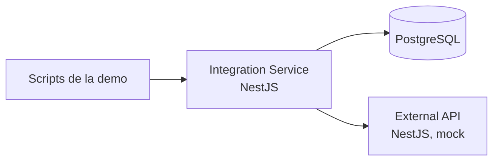

# Integración resiliente ante fallos de una API externa

Demo local para la charla **«Cuando una API externa falla: diseñando integraciones resilientes en AWS con ECS Fargate»**, AWS Community Day Perú 2026. El escenario muestra cómo continuar una operación desde el paso que falló, conservando el identificador de una transacción externa que ya fue creada.

> Una integración resiliente no es aquella que nunca falla. Es aquella que sabe qué hacer después de fallar.

La demo principal se presenta con dos comandos y dura aproximadamente 4–5 minutos. Usa exclusivamente datos ficticios: orden **#1001**, operación **OP-001** y transacción externa **EXT-78432**.

## Arquitectura



- **integration-service** ejecuta los pasos, persiste la operación y sus eventos, y clasifica los fallos.
- **external-api** simula un servicio externo. Sus respuestas de creación y confirmación pueden configurarse de forma independiente para provocar el escenario.
- **PostgreSQL** conserva el estado necesario para continuar y reconstruir cada intento.
- **Docker Compose** levanta los tres servicios. El contenedor de `integration-service` también puede empaquetarse para ECR y ECS Fargate; este proyecto no crea recursos en AWS por sí solo.

## Requisitos

- Docker con Docker Compose.
- Node.js 22.12 o posterior y npm para ejecutar los scripts de presentación y los tests desde el host.

No hace falta instalar PostgreSQL localmente.

## Preparación

Desde la raíz del repositorio:

```bash
npm install
docker compose up -d
docker compose ps
```

Espera a que los servicios aparezcan como saludables en `docker compose ps`. El servicio de integración expone `http://localhost:3000/health` y la API externa usa el puerto `3001`. El archivo [.env.example](./.env.example) muestra la configuración local disponible. Docker Compose proporciona valores ficticios para la demo; no requiere credenciales reales.

## Demo en vivo

Ejecuta únicamente estos dos comandos, en orden:

```bash
npm run demo:start
npm run demo:retry
```

### 1. Fallo deliberado

`demo:start` verifica los servicios, reinicia el escenario, configura la confirmación externa para devolver un error transitorio y procesa **OP-001**. La creación externa tiene éxito y devuelve **EXT-78432**. La confirmación falla con HTTP 500. La operación se detiene sin reintento automático:

| Campo | Valor esperado |
| --- | --- |
| `status` | `FAILED_RETRYABLE` |
| `currentStep` | `CONFIRM_EXTERNAL_TRANSACTION` |
| `attemptCount` | `1` |
| `externalTransactionId` | `EXT-78432` |

Puedes repetir `npm run demo:start`: limpia y reconstruye el mismo escenario, con los mismos identificadores y resultado.

### 2. Continuación manual

`demo:retry` exige que **OP-001** esté en `FAILED_RETRYABLE`, cambia la confirmación externa a éxito y llama a `POST /operations/OP-001/retry`. La operación continúa desde `CONFIRM_EXTERNAL_TRANSACTION`, actualiza el estado interno y termina:

| Campo | Valor esperado |
| --- | --- |
| `status` | `FINISHED` |
| `attemptCount` | `2` |
| `externalTransactionId` | `EXT-78432` |

El script comprueba que `POST /transactions` se haya ejecutado **una sola vez** entre ambos comandos. La transacción existente se reutiliza; la confirmación sí vuelve a intentarse.

Para inspeccionar el estado y la secuencia de eventos después de cada comando:

```bash
curl http://localhost:3000/operations/OP-001
curl http://localhost:3000/operations/OP-001/events
curl http://localhost:3001/admin/stats
```

Al terminar `demo:retry`, las estadísticas externas deben indicar `createCalls: 1`, `confirmCalls: 2` y `transactionsCreated: 1`.

## Flujo y estados

```text
VALIDATE → CREATE_EXTERNAL_TRANSACTION → CONFIRM_EXTERNAL_TRANSACTION
         → UPDATE_INTERNAL_DATABASE → FINISHED
```

| Estado | Significado | ¿Se puede procesar o reintentar? |
| --- | --- | --- |
| `PENDING` | Creada, aún sin ejecutar | `POST /operations/:id/process` |
| `PROCESSING` | Ejecutando un intento | No admite otra ejecución |
| `FAILED_RETRYABLE` | Detenida por un fallo transitorio | Solo `POST /operations/:id/retry` |
| `FAILED_BUSINESS` | Detenida por un error funcional | No admite retry |
| `FINISHED` | Flujo completado | No admite otra ejecución |

Un HTTP 5xx de la API externa se clasifica como error transitorio. Un HTTP 422 con `ORDER_CLOSED` se clasifica como error funcional. El retry de una operación `FAILED_BUSINESS` responde HTTP 409. No hay retries automáticos ni procesos en segundo plano.

Los eventos persistidos permiten ver qué ocurrió en cada intento. En el escenario principal, el primer intento registra éxito de `VALIDATE` y `CREATE_EXTERNAL_TRANSACTION`, seguido del fallo de `CONFIRM_EXTERNAL_TRANSACTION`. El segundo registra éxito de `CONFIRM_EXTERNAL_TRANSACTION`, `UPDATE_INTERNAL_DATABASE` y `FINISHED`.

## API de integración

| Método y ruta | Uso |
| --- | --- |
| `POST /operations` | Crear una operación |
| `POST /operations/:id/process` | Procesar una operación `PENDING` |
| `POST /operations/:id/retry` | Reintentar manualmente una operación `FAILED_RETRYABLE` |
| `GET /operations/:id` | Consultar el estado persistido |
| `GET /operations/:id/events` | Consultar la historia de pasos |
| `GET /health` | Comprobar la disponibilidad del servicio |

Las transiciones inválidas se rechazan con HTTP 409.

## Tests y cierre

```bash
npm test
docker compose down
```

Los tests cubren el flujo fallido, el retry manual, la conservación de **EXT-78432**, la ausencia de una segunda creación externa, el error funcional y la repetición del escenario inicial. `docker compose down` detiene los servicios. Para empezar también con un volumen PostgreSQL nuevo, usa `docker compose down -v`.

## AWS deployment

La **demo local** conserva el recorrido completo de resiliencia con PostgreSQL y la API externa en Docker Compose. La fase de **AWS deployment** prepara solamente la imagen de `integration-service` para ECR y ECS Fargate. Consulta [AWS-DEPLOYMENT.md](./AWS-DEPLOYMENT.md) para construirla, publicarla y revisar sus requisitos. La task necesita un PostgreSQL alcanzable antes de poder arrancar y responder `/health`; esta fase no lo despliega.

## Estructura

```text
apps/
  integration-service/  # Flujo, persistencia y API de operaciones
  external-api/          # API externa ficticia y controles de fallo
scripts/
  demo-start.ts          # Escenario de fallo, listo para presentar
  demo-retry.ts          # Recuperación manual, lista para presentar
docker-compose.yml       # Servicios y healthchecks
.env.example             # Variables de entorno locales de ejemplo
DEMO-SPEC.md             # Reglas funcionales del escenario
AWS-DEPLOYMENT.md        # Preparación y guía de despliegue a ECR/ECS
```

El código y la demostración usan únicamente datos ficticios. La demo funcional continúa siendo local; los archivos AWS preparan un despliegue posterior que requiere autorización y acceso a PostgreSQL.
